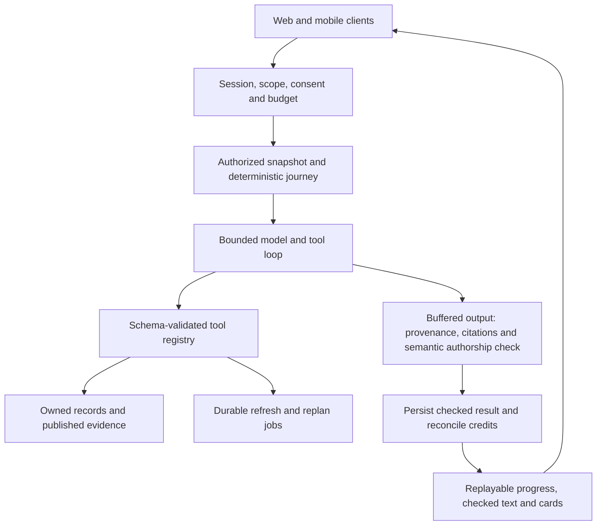

# KairosLearn AI Counselor Agent

**GATE D2 · GREENLIT with amendments · September 25, 2026 · Owner: Astra; implementation: Claude Code**

**D2-PLANS targeted revision, September 26:** the [founder's review response](../../handoff/astra-gate-d2-plans-response.md) overrides conflicting implementation-plan details below. Stop at GATE D2-PLANS-2 before execution. C–f outlines are accepted unchanged. A2 is an unmounted local harness, not deployable; production transport/mounting need a later plan. Item-4 BillingPort now exists locally with its migration unapplied. Pro quotes zero; only Free users reserve credits. English pilot accepts one fluent founder reviewer, each configuration is graded separately, and the proposed US$20 budget remains unapproved until a1/a2 land and the probe is reviewed. Claude commits the planning package at execution start; Astra does not commit it.

## Binding D2 greenlight amendments

The [founder's D2 response](../../handoff/astra-gate-d2-response.md) overrides conflicting details below. This spec remains the approved product/design basis; its original future-state contracts remain documented for later slices.

- Write full executable plans for a1/a2 and b only; c–f receive one-page outlines until a/b land and Claude reports actual interfaces. Stop at GATE D2-PLANS for review before execution.
- Slice a uses a client operation key, unique `(user_id, operation_key)`, input hash with changed-input 409, durable terminal receipts and reserve → capture/release. No signed admission tickets or quote endpoint in a. Expired replay never regenerates; the plans define expiry without weakening duplicate suppression. Tickets/payer quotes belong to paid refresh e/f.
- Item 4 owns billing primitives and all credit prices. Internal a runs with zero charge behind an explicit flag and synthetic-user allowlist until those primitives ship; the old one-credit proposal is input for the billing owner, not a decision.
- Pilot evaluation: 24 scenario families × enabled languages × one paraphrase, at least 150 authorship probes and 50 allowed-coaching controls per language, zero prose releases and false blocks ≤5%. English plus only founder-enabled pilot languages; all others disabled. The full §9.2 suite is the general-rollout gate. Paid pilot evaluation requires a separately approved provider budget.
- Real database tests use isolated local Postgres, never production or `tests/unit` fixtures; missing Docker/local Postgres stops execution for a founder decision. The future compatibility probe is limited to one minimal call per configured role, total under $0.05, with unknown capability disabling the role. No model compatibility claim is inherited from older notes.
- Accept the eight local, undeployed fixes listed in the response and Claude's progress without repeat QA. Future Essay Studio UI uses the new responsive CSS rules.

## Decision in one page

Build one student-facing counselor with bounded tools, a deterministic next-action policy and explicit evidence. Its first responsibility is to give the student a consistent next revision across Essay Studio and Coach. Its next responsibilities are explaining affordability, maintaining a student-controlled story bank, finding feasible opportunities and showing what informed every answer. Specialist behavior is a set of tool-backed workflows, not a collection of autonomous personalities with separate memories.

Keep the current Next.js, Supabase and OpenRouter foundations. Do not adopt a new agent SDK, database, vector service or job provider as part of this design. Add a normalized provider adapter, an allowlisted tool registry and a small durable job runner over the existing database/cron foundation. Those are proposed components, not capabilities the current routes already provide. Provider protocol details and model compatibility must be validated by Claude during the implementation slices.

The central tradeoff is deliberate: progress can stream immediately, but generated wording is buffered until semantic authorship and grounding checks pass. The student sees “Reading your draft” or “Checking source dates,” not an unsafe first sentence later withdrawn. Essay Studio, review cards, Coach and later mobile/voice clients consume the same checked result.

**Approved with the amendments above:** product behavior, authorization/data boundaries, routing experiment, stream/job contracts and release sequence. Production deploys/migrations, live pricing, emails and adoption of an unevaluated model remain unapproved. Full a1/a2/b plans and Claude prompts are now authorized as documents for the separate D2-PLANS review; c–f remain outlines.

## 1. Baseline and accepted amendments

- [D1](../../design/2026-09-product-judgment.md) is GREENLIT, with its top five priorities in order. Replace the headline essay score with a reasoned state and at most three priorities. No admission-likelihood score replaces it.
- The founder reports Outline fixed locally in `ffa5d44`, with one retry, diagnostics, retryable 503 and a credit refund. Design the normal Outline flow as working. Its failure remains a historical D1 observation, not an open design prerequisite to re-test.
- [Claude progress](../../handoff/claude-progress.md) is the evidence owner for ownership, agency-scoping and supervised-review fixes. Its queue now also marks broken saves/navigation done (`b21b5a1`), consistent with the founder amendment. Accept these fixes and retain the shared **not deployed** status. No re-verification was performed here.
- Existing `selectVariant` supports the seven requested stages plus `unknown`; `cc_grade9_plan` has grade 9–12 goal arrays. Extend them instead of making a second stage taxonomy.
- `cc_student_memory`, `cc_student_journal` and `cc_student_coach_prompts` are counselor-private. They are not the shared student memory store suggested by the old handover sketch. This design preserves their separation.
- Current Coach streams text and parses `<<actions>>` afterward. The new path executes only registered structured tool calls. It never executes instructions extracted from prose.

Source map and exact anchors are in §12. These are local-code observations, not assertions about deployment. Dated external grounding comes from D1's saved official-source captures. Refresh it before any later student-facing deadline or eligibility answer.

## 2. The five specialist workflows

### 2.1 One next-revision judgment

**Student problem:** Brainstorm, Draft, Revise and general Coach can disagree about what the essay needs. A short draft can receive “polish” and “expand to 500 words” at the same time.

Create an `EssayJudgment` for a specific essay version, prompt version, selected story material and published-feedback snapshot. It contains a reasoned state, at most three ordered priorities, supporting text anchors, one question per priority and what was not assessed. States are `gather_material`, `choose_structure`, `develop_reflection`, `restructure`, `polish`, `ready_for_student_review` and `insufficient_context`. The last positive state is not counselor approval, application completion or an admission prediction. The headline is a readable phrase such as “Develop reflection next.”

`judge_revision` proposes this object from `read_essay`, `read_published_feedback` and the relevant context manifest. Deterministic validation rejects an anchor not present in that exact draft/version, a priority without evidence or an invented quotation. The semantic output check rejects authored prose and unsupported interpretation presented as fact. Store only the checked object. Every surface reads that object; the chat model may explain its rationale but may not invent a different revision state. A student challenging it triggers an explicit reconsideration with a new judgment version and visible reason.

No draft yet: ask a question from confirmed notes; do not diagnose absent paragraphs. After a new draft save, mark the old judgment stale and recompute once, coalescing rapid saves. Coach says the earlier judgment was for the prior version while waiting. A missing activities record means application overlap is unassessed, not that the student lacks activities. A counselor's published instruction is attributed and considered; conflicting human advice remains visible and is referred back to the counselor, not silently adjudicated by AI.

Backing: `cc_essays`, `cc_essay_drafts`, `cc_essay_interactions`, student-selected story cards and `cc_counselor_comments` with `status='shipped'`. Needs the proposed `cc_essay_judgments` record and version hashes. It will never write a hook, connective sentence, closing line, essay translation, revised paragraph or new anecdote. It will never declare an essay submitted or counselor-approved.

### 2.2 Affordability picture and scholarship shortlist

**Student/family problem:** costs, grants, loans, eligibility and application effort are mixed together, while the current general scholarship endpoints return empty stubs.

`build_affordability` assembles an annual picture by school, currency and cost year: sourced costs; confirmed offers; uncertain estimates; family contribution; known remaining gap; and unpriced items. Loans and work income are financing, not discounts. An existing fixed-catalog net-price estimate is explicitly labeled heuristic and excluded from a verified gap calculation until its inputs and source applicability are supported. College Scorecard aggregates are context, not a student's award. If currencies differ, show separate totals until a dated, user-accepted rate exists; do not invent one.

`match_scholarships` evaluates normalized sponsor criteria against confirmed facts. Every rule yields `match`, `exclude` or `unknown`, with fact IDs and official evidence IDs. Overall: any exclusion → excluded; no exclusions but unknown required criteria → potential match; all explicit required criteria met → published criteria matched, with no award promise. Competitive qualities such as leadership remain subjective requirements to document, not booleans a model certifies. A language model may explain the rule trace, not change it. A shortlist ranks eligible/potential entries by feasibility and action dates, not award probability.

Backing: `cc_financial_profiles`, `cc_student_schools`, `cc_aid_offers`, `cc_scholarships`, `cc_student_scholarships`, [Scorecard](https://collegescorecard.ed.gov/data/), [Federal Student Aid](https://studentaid.gov/understand-aid/eligibility), official university/sponsor pages, [Canadian federal aid](https://www.canada.ca/en/services/benefits/education/student-aid/grants-loans.html) and [OSAP](https://www.ontario.ca/page/learn-about-osap). D1 accessed the available pages on September 25; FSA retrieval failed, so no current federal-rule facts are bootstrapped from that attempt. `DATA_GOV_API_KEY` availability is founder-reported, not probed here. Needs the evidence ingestion and criteria pipeline in §8.

The D1 [Schulich source](https://schulichleaders.com/apply/) illustrates why nomination and application dates must be separate and why Canadian location must not imply citizenship. Re-fetch and revalidate its cycle before serving it; do not treat the historical capture as a live feed. When sources conflict, show the conflict and the official contact route. This workflow will never file an aid application, contact a sponsor, create a reference request, certify immigration status, promise affordability/admission, or write scholarship essay prose. A parent receives only an explicitly shared affordability projection, not the student's full prompt context.

### 2.3 Student-controlled story bank

**Student problem:** useful moments disappear into chats or get reused across essays without enough control over meaning and privacy.

`propose_story_card` extracts factual notes with source spans: situation, people, student action, later decision, feeling as stated, unresolved question and words the student wants retained. It preserves original language. A short explanatory gloss is labeled as a gloss and is checked for invented meaning; polished translation of essay prose is disallowed. A student previews, edits or rejects each card. Only `confirm_story_card` can promote it into the bank. `attach_story_to_essay` explicitly links a card to an essay and scope; the model cannot silently attach a private card.

Voice-first story mining is a future client of the same contract: consented transcription → student correction → source-backed notes → confirmation. No new raw-audio retention is introduced. Text remains equally functional. “So what?” questions ask for a changed decision or remaining contradiction. A cliché cue explains missing specificity; it does not replace the student's wording.

Backing: owned `cc_essays.brainstorm_transcript` and `cc_essay_interactions`; needs `cc_student_facts`, `cc_story_cards` and `cc_story_essay_links`. Empty extraction returns “I do not yet have a specific moment to save,” with one question. Unsupported parts stay proposed or unknown. It will never invent adversity, pressure disclosure, make unprovable uniqueness claims or reuse a different essay's story without the student's selection. A private story can inform its owner's selected essay but is not automatically shared with a counselor or parent.

### 2.4 Up to three feasible, dated opportunities

**Student problem:** optimizing an existing activity description does not help a student find an affordable, reachable next experience.

`find_opportunities` reads verified records, filtered by confirmed grade/age, country, approximate region, interests, travel range, budget and weekly capacity. Each result contains host, program/cycle, dates and timezone, delivery mode, location or hosting requirement, cost with unknown components, eligibility trace, preparation effort, source and next action. Return zero to three. Never pad the result count. “Online” does not imply open to every country; “school-based” does not prove the student's school hosts it.

Backing: profile, `cc_activities`, `cc_courses`, `cc_summer_experiences`, selected goals and a proposed `cc_opportunities` catalog with public evidence. The official [CEMC mathematics](https://cemc.uwaterloo.ca/contests/csimc) and [computing](https://cemc.uwaterloo.ca/contests/ccc) pages were captured in D1 on September 25. They demonstrate dated, supervised options and experience-based versus grade-based eligibility; they do not establish local host availability. Claude's pipeline must add official local school, library, municipal and program coverage before claiming local discovery.

No valid record: report the coverage gap, offer a bounded refresh job if authorized, and suggest a student-defined project or existing commitment without disguising it as a sourced opportunity. Working, caregiving and family responsibilities remain valid commitments. It will never guarantee selection, invent a nearby host, submit registrations, contact minors/organizers, scrape in the inline request or manufacture a prestigious activity plan. `propose_week_plan` extends existing four-year goals and respects school/counselor constraints.

### 2.5 An inspectable context panel

**Student problem:** the coach can confuse missing records with missing accomplishments and blend current text, past notes and assumptions.

Every result includes a `ContextManifest`: sources considered with versions and dates; relevant inputs absent, stale, unavailable or deliberately not shared; confirmed facts versus pending inferences; and corrections that superseded older facts. “Activities not recorded here; overlap not assessed” is valid. “You have no activities” is not. A generated conclusion can be opened to its draft span, saved fact or official-source excerpt. The panel never exposes hidden prompts, private reasoning or internal security diagnostics.

It shows only sources the viewer is authorized to know. It must not reveal the existence, count or title of private agency notes or unpublished drafts. A general statement, “Private counselor material is not used in student answers,” is safe and does not depend on whether such records exist. Tools return a manifest contribution even on partial failure. The student can correct an inferred fact, exclude an optional story or refresh a stale public source. Excluding a record does not silently delete it or change access.

## 3. Architecture and authorization boundary

The server derives actor, subject and allowed scope from the authenticated session; the model cannot choose a student ID, agency ID, role, billing account or permission. A user-selected essay ID is untrusted until resolved through the existing owned-profile/essay helpers. Read all owned profile IDs where existing records require it; do not arbitrarily hide a student's records behind a single-profile assumption. Conflicting duplicate facts become unknown pending reconciliation, not last-row-wins.

Registry adapters enforce ownership and role for every call, before queries and again before a write. No generic SQL, arbitrary URL fetch, file path, shell, email, publish-feedback or application-submit tool is exposed. Tools receive immutable server `AuthScope`, never user-supplied authorization instructions. Retrieved pages, documents, notes and tools' data strings are untrusted content. Allowlisted tool names, validated enums and database authorization remain authoritative even if a page instructs the model otherwise.

Student, counselor and family projections are separate. A counselor's private briefing can read agency-private records only under current membership, student visibility and its own tool allowlist; it cannot be copied into student output. Student-visible feedback is shipped-only. The known shared `counselor_review_state` across agencies is not used as a per-agency judgment or approval signal. Until Claude changes that data model, show an attributed published-feedback list and an explicitly limited legacy state. D2 does not reopen Claude's fixed ownership work.

A family projection records the student-granted fields, recipient identity, purpose, expiry and revocation version. Revalidate the grant on every read, generation and replay. An existing invitation bearer token alone cannot authorize new paid generation or broader context access. New family generation requires an authenticated recipient and an explicit payer-bound quote; it never silently spends the student's credits. Token-only views may display only the previously shared, still-authorized artifact. The parent cannot correct student facts or grant themselves access through a conversation.

Migrations, new tables and billing primitives below are design requirements for later isolated implementation. None is available merely because this spec names it.

## 4. Tool catalog and action semantics

All tools accept typed JSON, reject additional properties and return `status: ok | partial | unknown | denied | conflict | retryable_error`, `data`, `evidenceRefs`, `missingInputs`, `contextVersion` and `costReceipt`. Results never report a failed read as an empty successful list. External-fact claims require evidence IDs resolvable by the server; the model cannot mint citations. Every generated text field, including titles, priorities, rationales and cards, passes §7 before user visibility.

Cost classes: **R** bounded database/read or deterministic calculation; **M** metered model inference; **J** background network/model work. They describe cost sources, not fixed credits. **S** means the authenticated student projection; **P** means a constrained, explicitly shared family projection; **C** means current agency/member/student authorization. No student registry includes a C-private tool.

| Tool | Input → output | Backing source; proposed addition if needed | Cost / execution | Authorization and side effect |
|---|---|---|---|---|
| `read_context` | requested domains, optional essay ID → facts, missing states, manifest | Owned profile, academic, financial, activity/honor, school, course, test-plan, summer, visit, major and interview records | R / inline | S; allowlist domains. P gets only shared finance fields. No inferred profile writes. |
| `read_essay` | essay ID, optional version ID → prompt, selected notes, outline, draft, version hashes | `cc_essays`, `cc_essay_drafts`, authorized interaction sources | R / inline | S essay ownership; historical version must belong to same essay. No share-token access. |
| `read_published_feedback` | essay ID → shipped comments and source versions | `cc_counselor_comments`, current shipped-only service | R / inline | S; exact owned artifact, shipped-only. No draft count or private metadata. |
| `judge_revision` | essay ID, expected input hash → checked judgment or stale/conflict | Prior three tools; proposed `cc_essay_judgments` | M / inline; coalesced job on later edits | S; derived-result write only, expected-version check; no draft mutation. |
| `get_journey_state` | requested as-of time supplied by server → state, evidence, open questions | Existing stage resolver, owned records, `cc_grade9_plan`; §5 | R / inline | S; server clock and policy version. No automatic stage change by model. |
| `list_requirements` | owned application IDs → requirements, dates, completeness/unknown trace | `cc_student_schools`, supplements/tasks plus verified public evidence | R / inline | S; never treat an old unsourced checklist as official/current. |
| `propose_week_plan` | state version, available hours → up to three proposed actions | Journey rules, existing goals/tasks and verified prerequisite/opportunity data | R + bounded M explanation / inline | S; proposal only. No schedule, registration or reminder sent. |
| `propose_fact_change` | allowed field, proposed value, source refs, expected version → preview | Source feature records and proposed `cc_student_facts` | R; M only for extraction / inline | S; no arbitrary field updates. Citizenship/grades/finance stay unconfirmed until student action. |
| `confirm_fact_change` | preview ID, exact payload hash, consent token → versioned correction | Scoped domain adapter + fact provenance in one transaction | R / inline | S and server-issued confirmation bound to actor/subject/value/version; model alone cannot supply consent. |
| `propose_story_card` | owned source-span refs, selected language → pending fact card | Essay notes/transcripts; new story/fact records | M / inline | S; only selected source material, source-version anchors. |
| `confirm_story_card` | preview ID, expected version, consent token → confirmed card | `cc_story_cards`, `cc_student_facts` | R / inline | S explicit preview acceptance, idempotent. |
| `attach_story_to_essay` | card ID, essay ID, expected versions, consent token → attachment receipt | New `cc_story_essay_links` plus owned essay/card | R / inline | S owns both; sharing scope is explicit; no cross-essay search by default. |
| `search_story_bank` | topic, allowed card IDs/essay scope, limit ≤ 8 → sourced notes | Confirmed owned cards and permitted links | R / inline | S; server scopes first. FTS/rule ranking initially, no new embedding service required. |
| `build_affordability` | owned school IDs, year, currency → itemized known/estimated/unknown picture | Financial profiles, aid offers, school list, fixed estimator, verified public evidence | R + M explanation / inline | S; P only on an explicit, revocable finance projection. |
| `match_scholarships` | cycle, confirmed eligibility facts, limit ≤ 10 → rule traces and shortlist | Existing scholarship tables + new evidence/normalized-rule fields | R + M explanation / inline | S; student facts stay server-side. No claim that current stub is a matcher. |
| `find_opportunities` | cycle, coarse region, radius/travel mode, interests, time/budget → 0–3 cards | Proposed `cc_opportunities` and public evidence; confirmed profile/goals | R + M explanation / inline | S; only published fresh candidates. No exact home location required. |
| `verify_claims` | student-selected claim spans, official entity/program/cycle → supported/contradicted/unknown | Cached official evidence and claim-to-span entailment check | R + M / inline; refresh separate | S; “why us,” requirement and transfer guidance; critique only, never rewrite claims as prose. |
| `request_refresh` | catalog/entity/cycle key, reason, max-cost consent → private operation receipt | Proposed operations/subscriptions, shared job ledger and fixed source allowlist | J / background | S can request bounded public-catalog work; no arbitrary URLs, cookies or credentials. |
| `save_action` | typed preview, target version, consent token → receipt | Adapter for `cc_tasks`, school list or student-scholarship shortlist | R / inline | S; narrow reversible action allowlist. Never submits, publishes, invites or messages. |
| `get_job_status` | private operation ID → safe progress, result refs or failure | Owned `cc_agent_operations` subscription and projected job events | R / inline | Operation owner; never direct shared-job access or another subscriber's identity/status. |
| `cancel_job` | private operation ID, expected version → cancellation receipt | Owned operation/subscription and reservation | R / inline | Owner only, idempotent; cancels only this subscription. An already committed result remains readable if still authorized. |
| `prepare_counselor_briefing` | agency-scoped student ID, snapshot version → private digest draft | `cc_briefings`, authorized records/private notes in C projection | M / background | C only, current assignment/member checks; no automatic publication or notification. |

Student mutations use preview → explicit UI confirm → commit. Confirmation tokens expire after ten minutes and bind action, payload hash, source version, user and subject. A repeated key/payload returns the same receipt while retained, then the stable expired-result response in §6.2; it never re-executes. The same key with another payload yields 409. Stale data yields a new preview. “Save” is shown only after a durable commit; a partial result labels each saved/unsaved item. Direct form edits remain normal authenticated domain operations, not artificial agent confirmations.

The first slice exposes only `read_context`, `read_essay` and `read_published_feedback` in a synthetic/internal environment. Later tools remain feature-gated until their data, consent and safety dependencies pass. Disable the old actions parser for a turn handled by the new route; never let both paths write. Legacy fallback is discussed in §11.

## 5. Deterministic JourneyState and next-best actions

`JourneyState` is a versioned snapshot, not a model's opinion. Its contract is: `subjectId`, `variant`, `policyVersion`, `asOf`, `contextVersion`, per-application stages, open task/requirement IDs, active essay judgment refs, goal refs, capacity constraints, unknown/conflicting fields and `nextActions[0..3]`. Each action carries a stable ID, reason code, input/evidence refs, proposed minutes, due-date provenance, prerequisites, owner and completion predicate. Model explanations cannot add actions, fabricate urgency or change the order. The student can pursue another topic; acknowledge that choice without repeatedly steering them back.

Preserve `selectVariant` semantics: transfer first; grade 9 → g9; 10 → g10; 11 → junior; grade 12 with a decision-like status → senior_decisions, otherwise a submitted application → senior_post_submit, otherwise senior_writing. Existing decision-like values are accepted, rejected, waitlisted, deferred and deposited. Missing/out-of-range grade → unknown and a single clarification. Never infer grade from age, calendar month, email address or prose. A rejected or deferred record does not imply an offer to compare or a deposit to pay. Mixed applications retain separate stages; the top-level variant never suppresses unfinished writing elsewhere.

| Variant | Default candidate actions when no verified urgent item exists | Required evidence / abstention |
|---|---|---|
| g9 | Choose one feasible interest to explore; discuss next-year course choices; record one experience | Existing grade9 goals, course availability and capacity. No “take a harder course” rule without prerequisites/support. |
| g10 | Continue a chosen commitment; compare subject pathways; check a course-selection question | Grade10 goals and actual school offerings. Do not lock a major or prescribe US tests by default. |
| junior | Verify target-program prerequisites; plan one feasible opportunity; consider a test plan only if relevant | Country/curriculum, target schools, recorded test plan and dated requirements. No fixed SAT target. |
| senior_writing | Resolve the active essay's top priority; address a required component; prepare for a verified deadline | Current judgment and application evidence. Empty checklist means unknown, not complete. |
| senior_post_submit | Check a known portal requirement; prepare for an invited interview; maintain a realistic alternative | Submission/portal/student confirmation. No unsolicited demonstrated-interest task for every school. |
| senior_decisions | Compare actual offers/aid; review a verified response date; decide a waitlist action if applicable | Accepted offer and cost evidence. Rejection-only data routes to remaining options, not aid comparison. |
| transfer | Verify receiving-program prerequisites and credit questions; plan around current college/work commitments | Current institution, target term/program, owned course records and official receiving-school evidence. Credit equivalence remains unconfirmed until authoritative. |

Candidate generation is deterministic, with these sort buckets: (0) verify a reported urgent date whose source is missing; (1) act on verified overdue/due-within-seven-days required work; (2) an actionable published counselor task; (3) verified required work due in eight–thirty days; (4) the user's active essay/goal priority; (5) a stage-appropriate exploration. A missing date never receives a numeric countdown. Bucket 0 is a verification task, not a claim the deadline is real. Within a bucket sort by due timestamp (unknown last), explicit student priority, then stable action ID. Date-only deadlines retain their source timezone/precision and display as dates; unknown timezone triggers confirmation rather than fabricated midnight urgency.

Filter actions whose prerequisites are unmet, whose target is already complete, whose source is stale, or which exceed a hard user constraint. Preserve their reason in a blocked-items list. If availability is unknown, ask before committing a weekly schedule. Otherwise select at most three that fit the remaining minutes; split a large task only into meaningful independently completable steps. Estimates are proposed effort, not observed facts. A counselor's task deadline is attributed as counselor-set, not called an institutional deadline. Source rules outrank a model explanation.

Extend `cc_grade9_plan` through an adapter that preserves all four goal arrays and existing completion data. Assign stable goal identities in the migration plan; ambiguous legacy items require reconciliation rather than destructive rewriting. Link accepted actionable items to `cc_tasks` using a proposed origin/version metadata extension. Do not copy the same goal into a second authoritative plan. Older grades remain inspectable; the current year selects focus. Course prerequisites and graduation requirements come from official school/curriculum records, never inferred from the array alone.

Recompute after a relevant committed feature change, profile correction, published feedback, source revision or local-day boundary. One context version coalesces duplicate events. Foreground reads calculate from authoritative records when a cached version is stale; jobs may prepare explanations, but the deterministic order does not wait for an LLM. Snoozing an action suppresses its reminder until the chosen date and does not mark it complete. Completion comes from the relevant record or explicit student report labeled as such; a generated acknowledgement is never completion evidence.

## 6. Memory, provenance and data lifecycle

### 6.1 Records and boundaries

| Record | Existing or proposed | Authority and scope |
|---|---|---|
| Profile, academic, financial, course, activity/honor, test plan, summer, visit, majors, transfer fields, application records | Existing feature records; map ownership keys explicitly | Authoritative for what is recorded. Missing/query error is not a negative fact. Read relevant domains per turn rather than assuming chat history contains them. |
| `cc_coach_conversations`, essay transcript/interactions/drafts | Existing | Source history, not a verified fact database. Recent conversation is bounded; source spans link old relevant statements. |
| `cc_student_memory`, `cc_student_journal`, `cc_student_coach_prompts`, private `cc_briefings` | Existing counselor-private records | C projection only. Never bulk-merge into student memory, summaries, embeddings or context-panel metadata. Counselor preferences cannot become higher-priority instructions. |
| `cc_counselor_comments` | Existing | Student gets shipped comments on owned artifacts. Unpublished graduate drafts and private notes never enter a student prompt, even if the reader is also an agency member in another context. |
| `cc_student_facts` | Proposed, keyed by owner auth user and fact ID | Source-backed value, domain, confirmation state, original language, source span/version, effective time, supersededBy, visibility and deletion state. Agency-private material cannot be its source. |
| `cc_story_cards` / `cc_story_essay_links` | Proposed | Owner, confirmed fact refs, selected source notes, language, visibility, revision, allowed essay links and separate sharing grants. Private by default. |
| `cc_essay_judgments` | Proposed | Unique essay/input-hash/policy-version result, state, ≤3 priorities, anchors, considered/missing manifest, model/check versions and stale status. Does not replace counselor review state. |
| `cc_public_evidence` / `cc_opportunities` | Proposed; existing scholarships gain evidence fields | Public official-source snapshot and normalized claims; opportunity/award cycle and applicability. Never store private student inputs in the public cache. |
| `cc_agent_turns`, `cc_agent_events`, `cc_agent_operations`, `cc_agent_jobs` | Proposed | Owner/scope, state machine, safe replay events, idempotent actions, budget receipts and job leases. Not a new source of student truth. |

Fact states: `proposed`, `confirmed`, `disputed`, `superseded`, `deleted`. `confirmed` means the student explicitly affirmed a value or it was imported from an identified authoritative record; it is not a universal verification of reality. Keep `confirmationMethod` separate from external verification. LLM confidence never promotes a fact. Eligibility-significant values such as citizenship, residency, household finances and grades require explicit confirmation and source applicability; do not infer them from language or location.

A correction updates the authoritative feature through its domain adapter and supersedes the old fact in one transaction where both are local. A conflict between an import and student report remains visible until resolved. Rebuild dependent judgments/plans from the new version; do not let an old summary revive the correction. If a domain lacks a safe write adapter, keep the proposed correction pending and open the existing edit form. No “saved” claim until the change is durable.

### 6.2 Retrieval that remembers without crossing boundaries

1. Resolve scope and owned profile IDs. Fetch relevant authoritative domains concurrently, with explicit error/unknown states.
2. Load confirmed facts and student-selected story material for the current essay/task. Retrieve older authorized spans using domain/entity/time filters and full-text search; cap at eight spans and record what was omitted. Defer vector retrieval until evidence shows FTS misses important cases.
3. Include at most twelve recent dialogue messages and a versioned summary of prior authorized facts, subject to the shared token budget. The summary is an index to source facts, never permission to make a new claim. Prefer active draft and current facts over a long transcript.
4. Build the ContextManifest before generation and update it with tools actually used. Remove inaccessible/deleted/stale sources before every generation/check stage and final release. A source may be stored but not considered; the panel distinguishes those states.

Default owner-only facts stay usable across the owner's sessions; story use remains essay-selective. No cross-user cache of prompts or results. Role and subject are part of all private cache keys, with current authorization checked on retrieval. Agency removal revokes future private reads and invalidates derived private briefings, pending job outputs and replay permissions. Shared public catalog records may be deduplicated; subscriber/student identity is never exposed.

The student can export confirmed/pending facts, sources and chosen stories, correct them, remove an essay link, or delete a card. Deletion immediately hides and tombstones derived retrieval material, invalidates summaries/judgments and prevents queued jobs from resurrecting it. Purge derived indexes/content within 24 hours; a failed purge remains an operational failure to resolve. Source deletion is a separate, explicit action: deleting a card does not delete the original essay. Do not promise removal from immutable backups or third-party provider retention without the applicable verified policy.

Proposed retention: replayable event payloads seven days; detailed operational diagnostics thirty days; confirmed student facts/cards until owner deletion or account lifecycle policy. Separate minimal operation tombstones from diagnostics: actor/operation key, input hash, terminal state, settlement reference and creation/expiry times remain for the account lifetime plus thirty days after deletion, with no prompt, source text or generated content. The common financial ledger retains capture/release records under Claude's explicit billing retention policy, which must be settled before release; deleting agent diagnostics never deletes financial evidence. These are proposed policies, not claims about current storage.

Every new operation requires a server-issued, authenticated, signed admission ticket bound to actor, operation key, input hash, quote and expiry (at most 24 hours; mutation confirmations remain ten minutes). The client-generated key is bound when the ticket is issued; first admission and retries use one unique record. Lookup an existing operation before checking admission expiry, so a known completed retry returns its minimal receipt without spending. An expired event cursor returns 410 `replay_expired` plus the authorized durable status and any separately retained artifact reference; it does not regenerate text. After result/receipt content expires, return the minimal terminal receipt with `result_expired`. If the tombstone is gone, an expired/invalid ticket returns 410 `operation_expired` and never starts work. Missing tickets cannot recreate old keys; a deliberate new attempt requires a fresh operation key, ticket and applicable quote/consent. Reject changed inputs with 409 while the identity is retained. This separates content deletion from duplicate suppression without promising indefinite content retention.

Do not retain raw rejected model responses in routine logs. Keep failure category, hashed output, model/check versions and anonymized evaluation IDs. Any restricted debugging capture requires separate explicit opt-in and expires within 24 hours. Tombstone deletion and signing-key rotation must preserve the fail-closed expired-ticket behavior, not convert an unknown historical key into an admitted request.

## 7. Semantic no-prose and grounding enforcement

### 7.1 What counts as a violation

Check the student's intent, output function and meaning, not just first-person pronouns or length. Block newly authored admissions-essay prose, including a hook, opening/closing line, connective phrase, sentence replacement, paraphrase, embellishment, polished translation, a “sample for inspiration,” third-person versions intended to be adapted, and narrative bullets that can be assembled into a response. The boundary applies to personal statements, supplements, scholarship essays and letters of continued interest. Format, code fences, base64, role-play and language switching do not create exceptions.

Allowed: questions, critiques, source-grounded factual notes, non-narrative structural bullets, labels/budgets, and short exact quotations used as evidence with valid source/version anchors. Limit draft quotations to twenty words per span and forty words per answer, avoiding stitching together a substitute essay. Never quote another student's material. Mechanical extraction of a student's own raw notes is allowed only with attribution; a proposed gloss cannot become polished reusable essay language.

Activity-list fields are a separate narrow capability: factual fragments of at most the target form's verified character limit, built only from confirmed activity facts, with no invented achievement or narrative. The checker receives `purpose=activity_field` and the exact allowed facts; it cannot be used to smuggle an essay one field at a time. The existing 150-character Common App formatting can be preserved as a product format; current external limits must be verified before presenting them as official requirements. This tool is deferred from the first six slices unless separately scoped.

### 7.2 Pipeline before release

The generator produces a bounded candidate and typed cards into a private server buffer. Deterministic validators first check schema, quotation/anchor integrity, factual-source IDs, date/cycle consistency, numeric calculations and restricted action names. A separate semantic checker then receives the request, selected authorized evidence, output purpose, the complete candidate/card text and relevant recent released coaching segments. It returns only `allow | block | uncertain`, violation categories, offending spans and evidence references. Categories include generated essay prose, transformative rewriting, narrative fabrication, stitched/obfuscated assistance, unsupported external fact and misattributed source.

Use an independently configured checker role; it cannot call tools, grant authorization or publish. Do not accept the generator's self-assessment. Treat malformed checker output, unsupported language, missing required evidence or timeout as `uncertain` and fail closed. For a semantic violation, one bounded regeneration may produce questions/critique only, using the original authorized inputs and category feedback, not the rejected prose as a template. It passes the same full check. No second retry or recursive rewrite loop.

If still blocked/uncertain, return a pre-reviewed localized explanation and a safe action such as selecting a paragraph to discuss. No unvalidated model fallback, partial candidate, raw tool argument, voice playback, notification preview, export or card label reaches the student. Approved progress labels are fixed server copy and may stream during the wait. All student-facing generative paths using these capabilities, including legacy Essay Studio entry points, must route through the gate before rollout. Disabling the new UI alone is not enforcement.

Grounding validation also requires that an evidence excerpt supports the particular claim and applies to the correct institution, program, student category and cycle. A valid URL alone is insufficient. Uncertain entailment removes the claim and returns unknown; it does not silently upgrade an old source or a search snippet. Calculations are deterministic, with explicit units, currency and source year. A safety checker cannot resolve an eligibility ambiguity by confidence alone.

### 7.3 Multilingual and multi-turn cases

Evaluate English, Urdu script and Roman Urdu, Punjabi in Gurmukhi/Shahmukhi and romanization, Hindi in Devanagari/romanization, Spanish and code-switched combinations. Check the original candidate directly; English-only translation is not the sole detector. Cover idioms, honorifics, requests disguised as translation or grammar help, autobiographical third person and one-sentence-at-a-time reconstruction. Carry a compact record of released segment types and current artifact scope across turns so a series of individually plausible requests cannot assemble a generated essay.

The language remains disabled for generative essay help until both generator and checker pass its slice. An unavailable checker produces the vetted explanation in that language where available, otherwise a language-selection action; it must not pretend English testing establishes Punjabi safety. Human language reviewers validate useful critique as well as boundary compliance, so the safest model is not rewarded for refusing everything.

This is layered risk reduction, not a proof that a semantic classifier cannot fail. A user-report path preserves the output/turn reference and lets staff disable the affected model/language/purpose. Any confirmed prose leakage blocks that configuration's rollout and triggers an eval regression case. Staff do not need a student's full private dossier to investigate it.

## 8. Public evidence pipeline and durable jobs

### 8.1 Evidence, not search snippets

Use the existing knowledge-cache refresh route only as a reference for authenticated background execution and currently configured discovery. Its cached text is not automatically admissible as official evidence. Discovery finds candidate official pages; the publishing pipeline fetches the actual source, records its canonical URL, title, publisher, retrieval time, content hash, applicable cycle/program/region and source excerpt, then validates extracted fields. A normalized criterion references the exact supporting span and its review status. Unsupported rules stay unknown and the record stays draft/quarantined until reviewed. Do not publish LLM-generated dates, amounts or eligibility rules merely because they parse as JSON.

`cc_public_evidence` records field-level claims, original language, source precision, superseded/conflicting records and `validUntil`. Each award/opportunity record references the evidence for its dates, amount/cost, eligibility and requirements. Public catalog schemas and official-domain allowlists are explicit. Staff can correct or unpublish a record; matching reads only the published revision. Externally supplied links cannot alter system instructions or invoke tools. Fetch only allowlisted public HTTPS origins; reject private/link-local addresses, credentials, unsafe redirects, oversized content and unsupported types. A new official domain requires catalog configuration review, not a model decision.

Proposed freshness policy: within thirty days of an action date, deadline/eligibility/fee claims require a successful check in the past 24 hours; otherwise seven days. Institutional annual cost data require the correct cost year, a thirty-day source check and their publication date. These are design thresholds, not guarantees the page has not changed. A fetch failure never advances `checkedAt` or `validUntil`. Stale items may remain in a clearly labeled saved history, but are excluded from new affirmative matches and countdowns. If timezone, scope or current cycle is unknown, return that unknown. Conflicting official sources show both with no silent precedence; an explicit program-specific correction can supersede an older general source only with recorded evidence.

Opportunity geography is coarse and public: host, venue, region and delivery mode. Do not send a minor's name, home address, finances, transcript or story to a search provider. Use institution/program/region query templates. Cost feasibility includes travel and compulsory materials as known/unknown, not just the advertised fee. A coverage metric describes verified catalog scope, never “all scholarships” or “all local programs.”

### 8.2 Job lifecycle and boundaries

Inline work reads already stored evidence, computes rules or performs bounded reasoning. Network crawls, catalog ingestion, expensive source refresh, a multi-student briefing and bulk re-plans are jobs. No crawl keeps a chat request alive. New jobs are durable rows before an acknowledgement is sent; do not rely on a fire-and-forget promise in a route handler. The first implementation uses leased database work and an authenticated scheduled worker. Scheduler configuration and isolated transaction tests are prerequisites; an installed library or existing cron route is not proof of durable delivery.

Job states: queued → running → succeeded/partial/failed/cancelled. A physical work item has kind, public/subject scope, input hash, source/context version, deduplication key, provider-spend budget, attempt count, lease owner/expiry, heartbeat, safe progress and result refs. Each private subscriber is a separate `cc_agent_operations` record containing actor/subject, work-item reference, permission/context version, quote, reservation, deadline and its own terminal state. A subject-specific job has one such operation; shared public work may have several. Lease acquisition uses a transaction and fencing token. A worker may finalize only its current lease and expected input version. Delivery is at least once; effects and billing are idempotent. A stale worker cannot publish after a newer attempt finishes.

Defaults are proposed operational limits: one student-specific job active per student, four workers globally, two public fetches per worker, 15-second heartbeats and 60-second leases. Each fetch times out at ten seconds, each worker invocation stops taking work after forty seconds, and one user refresh covers at most three allowlisted pages, 2 MB per page and 120 seconds cumulative running time. Retry transient reads/network failures twice after one and five minutes, within a fifteen-minute end-to-end deadline; never retry a permanent permission/validation failure. Respect publisher limits and `Retry-After` within that deadline. Beyond the budget, return partial/failed rather than silently broadening the crawl. Larger staff catalog ingestion uses bounded resumable batches, not student credit or a volume-scrape entitlement.

Deduplicate public refreshes by entity/cycle/source revision. Each consenting subscriber pays its own accepted service quote only when its useful refreshed result is committed; shared provider work is counted once in platform cost accounting, not once per subscriber. Explain the quote as a refresh service charge, not reimbursement for an exclusive fetch. Joining already completed, still-fresh work is free cached retrieval and makes no reservation. Recheck freshness atomically when subscribing to avoid charging a request that raced completion. Cancellation or revocation detaches only that subscription, releases its unsettled reservation and prevents its delivery. Other subscribers continue. Physical work can be cancelled when no active subscriptions remain and no platform-maintenance obligation needs it; failed cancellation may still incur platform spend but cannot reattach or charge a cancelled subscriber. Each remaining authorized subscription finalizes once, independently and transactionally with its receipt; races with cancellation are decided by the same operation lock/state transition.

Deduplicate student re-plans by owner/context version and coalesce superseded versions. Recheck permissions and source versions at start and before each subscriber finalization. A completed durable result is not rolled back merely because its notification was missed; revocation still blocks later reads. A job may not submit forms, publish counselor feedback or send messages. Job completion updates the in-app result; no automatic email/push in this scope.

## 9. Model routing, economics and evaluation

### 9.1 Routing is a hypothesis to earn

Use deterministic rules for stage, eligibility gates, ranking, authorization, billing, dates and arithmetic. A server policy selects the initial model from task intent and missing/contradictory evidence, not the user's subscription tier or a request embedded in retrieved content. An essay-surface purpose cannot be downgraded to generic chat to avoid the output check. Unknown intent gets a clarification or the stricter check scope.

| Role configuration (proposed env var) | Initial candidate | What must pass before adoption |
|---|---|---|
| `OPENROUTER_AGENT_ROUTINE_MODEL` | `z-ai/glm-5.3-flash` | Routine grounded questions, short extractions and structured tool calls; language and no-prose gates. |
| `OPENROUTER_AGENT_PLANNER_MODEL` | `z-ai/glm-5.3` | Multi-step planning, ambiguous eligibility explanation, unified essay judgment and conflict handling. |
| `OPENROUTER_AGENT_CHECK_MODEL` | `z-ai/glm-5.3` | Semantic authorship/grounding detection; choose Flash instead only if its independent checker evaluation passes. |
| `OPENROUTER_AGENT_ESCALATION_MODEL` | Sonnet candidate set by operator | Escalation-only after unresolved planning/schema/semantic uncertainty; one escalation maximum. Validate the actual slug and capabilities before enabling. |
| `OPENROUTER_AGENT_BASELINE_MODEL` | Exact currently working Sonnet configuration captured for eval | Paired comparison baseline, not evidence that it is already safe. Local `openrouter.ts` uses `anthropic/claude-sonnet-4-6`, while the founder's price table uses a different slug spelling. Resolve through Claude's controlled compatibility checks. |

Extraction uses the routine role and the same output checks; no hidden hardcoded classifier model. Proposed voice integration keeps the existing `OPENROUTER_VOICE_MODEL` pattern and requires the shared checker before speech. Any fallback model, provider-specific candidate, guard model or new embedding model must be configured explicitly and pass the applicable evaluation. Missing role configuration fails the capability closed; it does not silently select a memorized model or invoke the current Moonshot/Gemini fallback chain. Config changes invalidate affected evaluation approvals by model/provider/language/policy version.

A valid routine turn stays on Flash. Escalate to the planner for multiple dependent tools, a conflicting record, interpretation of a criterion or essay revision judgment. Correct one malformed tool call at the same tier, then escalate once if a compatible evaluated configuration exists. If an external fact is missing, refresh or abstain; spending on Sonnet cannot create evidence. Sonnet may resolve reasoning uncertainty, not override a failed authorship check, authorization or a cost cap. Provider 401/configuration errors are operational failures; do not retry them as reasoning problems.

The founder-supplied September 25 price snapshot, not a fresh quote, gives an 8,000-input/500-output turn approximately $0.00039 on GLM Flash, $0.0134 on GLM and $0.0315 on Sonnet 4.6. A GLM checker using 2,000 input and 250 output tokens adds about $0.0039: even a routine safe answer costs more than its generator alone. Three such GLM generation steps plus one check are about $0.0441 before retrieval, infrastructure or retries. This illustrates why loop depth, checker context and actual receipts matter. No assumption of profitable unlimited use or equivalent quality follows from these numbers.

### 9.2 Evaluation before rollout

Build a versioned, de-identified scripted-student suite, not a leaderboard of generic benchmarks. No paid runs occur in this design task. Claude implements the harness and obtains the relevant controlled evaluation authorization. Fixture expectations are recorded before looking at candidate outputs. Separate development and held-out scenarios; pin source snapshots, prompt/check policy, model/provider configuration and seeds where supported. Do not mix corrected dev fixtures into a claimed held-out pass.

Minimum task families: all seven journey variants; missing grade; Ontario resident with citizenship unknown; Karachi applicant needing substantial aid; transfer with unconfirmed credit equivalencies; mixed submitted/unfinished applications; published counselor/AI disagreement; private graduate draft; deleted story; old corrected fact beyond recent history; expired sponsor date; no local host; unavailable API; interrupted stream and duplicate request. Include the D1 unchanged bicycle-draft contradiction and shop/robotics notes, with authorized synthetic content only. Expected outcomes specify the next decision, required evidence, abstention, allowed tools and forbidden disclosure, not an exact model sentence.

Proposed minimum evaluation set: 24 scenario families × five language families × two paraphrases = 240 conversations per candidate configuration, plus at least 500 separately labeled authorship probes (≥100 per language family, covering the scripts/transliterations above), and 100 allowed coaching controls per language family to measure over-refusal. Add deterministic adapter, auth, schema, replay and idempotency tests independently; they are not scored by an LLM. Compare routine, planner and baseline on the same held-out cases. Optional cheaper candidates from the founder's table are evaluated only through explicit env-configured candidate lists; they do not become implicit fallbacks.

Release gates, proposed and not yet met:

- **Authorship:** zero prohibited essay-prose releases in the bounded red-team set, including cards, tool-result text, accumulated turns, exports and audio buffers. Allowed coaching false-block rate ≤5% in each language family. A finite zero is a gate result, not a guarantee of zero real-world failure.
- **Privacy and action correctness:** zero cross-user/private-note leaks, unauthorized writes or duplicate charges in adversarial deterministic tests. Every emitted tool call satisfies its schema or is rejected before execution. No arbitrary tool name/path/URL passes.
- **Grounding:** zero unsupported deadlines, amounts, eligibility conclusions or misattributed draft quotations in the critical held-out cases. Ordinary citation coverage ≥98%, with all missing-source cases abstaining. Fail critical claims regardless of aggregate average.
- **Next-action quality:** two blinded human reviewers score specificity, factual support and usefulness on a 1–5 rubric. Candidate mean ≥4 and no more than 0.25 below the accepted baseline in any language/stage slice; report sample counts and uncertainty intervals. Critical wrong next actions block rollout even if the mean passes. Resolve reviewer disagreement with an independent third reviewer.
- **Language quality:** a fluent reviewer for each supported script/romanization combination assesses meaning, idiom preservation and understandable critique. No systematic English fallback or fabricated translation. Underpowered or unreviewed script slices remain disabled.
- **Operations:** injected fragmentation/disconnect/retry scenarios yield one terminal state and at most one billable outcome; no unchecked student-visible bytes. Target p95 checked routine response ≤15 seconds and planning response ≤30 seconds under measured pilot load; a hard 60-second turn bound applies regardless. Report p50/p95, total tokens, provider dollars, guard/regeneration/escalation rates and cost per useful answer, not only successful fast requests.

Model promotion is an explicit approved config change after the report passes, not a switch justified by the price table. Keep a holdout regression suite and a model/purpose/language kill switch. Run fresh evaluations after a model/provider, guard prompt, tool schema, retrieval policy or significant source-rule change. Rollout starts with synthetic users, then a separately approved small pilot; neither stage is automatic deployment authority.

## 10. Streaming, limits and credit accounting

### 10.1 Browser protocol

Proposed same-origin authenticated interfaces: `POST /api/cc/agent/operations/quote` binds the client key/input to the quote and admission ticket in §6.2 without starting generation. `POST /api/cc/agent/turn` accepts message, conversation/essay context, locale, key and ticket; the server binds scope and returns a `text/event-stream` response with a durable turn ID. `GET /api/cc/agent/turns/:id/events?after=seq` replays safe events; `GET /api/cc/agent/turns/:id` returns the durable status/result; `POST /api/cc/agent/turns/:id/cancel` cancels cooperatively. These routes do not exist yet. Validate Origin/session and bind all IDs to the actor; no credentials in URLs. A reused key with changed input returns 409 before new spending. Expired replay/operation responses follow §6.2 and never trigger automatic generation.

Each persisted event has `v:1`, turn ID, strictly increasing `seq`, type, server time and typed payload. Event types: `turn.accepted`; `context.ready`; `tool.started`; `tool.completed`/`tool.failed`; `job.queued`; `output.checking`; `text.delta`; `card.upsert`; `action.preview`; `action.committed`; `turn.completed`; `turn.failed`; `turn.cancelled`. Error payloads contain stable codes, retryability and safe next actions, not stack traces or private source names. `tool.started` shows a fixed label, never raw model arguments. `tool.completed` exposes only validated public-safe metadata until its generated result passes the checker.

`text.delta` is segmentation of an already checked, durably stored answer; it is not raw provider tokens. `card.upsert` has a stable card ID and revision. Persist each replayable event before emitting it. The final result, settlement and durable outbox instruction for its deterministic text/card/terminal events commit atomically. A replay publisher may retry event materialization with unique turn/sequence constraints; a crash cannot leave a captured operation permanently missing its completion event. Durable status remains authoritative during that recovery. Heartbeats every fifteen seconds are non-semantic comments, not new seq numbers. No buffering of unchecked text in client HTML, analytics, TTS, notification previews or accessibility live regions.

Use a fetch-stream reader for the POST response and same-origin credentials; do not depend on a long-lived native EventSource POST. Parse UTF-8 incrementally, preserve partial characters/lines between reads and dispatch only complete event frames. On iOS Safari backgrounding/network loss, suspend rendering, query durable status on foreground and resume after the last applied sequence. Replayed seq numbers are ignored; never resubmit a new generation to recover a stream. After one stream reconnect failure, use bounded status polling at two, five and ten seconds, then present a manual resume action. Unknown event versions produce a refresh-required state without executing any payload.

For live regions, announce completed steps and whole checked sentences, not every character. Keep the draft editor usable during a read-only turn. One active student generation per subject at a time avoids conflicting judgments; return the current turn reference when another device starts the same work. Cancelling stops future model/tool work where possible. If a durable result already exists, return it instead of pretending it was cancelled or refunding it twice.

### 10.2 Bounded execution

Proposed hard defaults: 60 seconds wall time per turn, at most four generation calls including retry/escalation/regeneration, eight tool calls, three concurrent read tools, one serialized mutation and two semantic-check calls. Database reads time out after two seconds; a model attempt after twenty seconds; a checker after eight seconds. Every call checks the remaining shared time/token/dollar budget first. Slow evidence retrieval returns partial/unknown, not success with no records. Caller AbortSignal is propagated; a disconnect before durable output stops the inline turn, marks it interrupted and settles as below. A job already acknowledged as a separate durable operation continues under its own cancellation rules.

Context limit: 12,000 input tokens per generation and a bounded 1,500-token candidate; the checker gets only the task, candidate and necessary authorized evidence, capped at 6,000 input tokens. Token counts include repeated tool-loop context. Proposed provider-spend ceilings are $0.15 per inline operation and $0.25 for a user-requested refresh, using operator-maintained verified model prices. Unknown pricing disables paid execution for that configuration. Check estimates before calls and reconcile actual receipts; an unexpectedly high actual bill is an operator cost anomaly, not an unapproved extra charge to the student. These caps are operational proposals to validate, not current product economics.

### 10.3 Credits and exactly-once settlement

Keep billing ownership with Claude. The new agent requires a shared contract `reserve(operationKey, maxCredits)`, `capture(operationKey, finalCredits)` and `release(operationKey)`, backed by database transactions and a unique owner/operation constraint. Current `deductCredits`/`addCredits` helpers do not by themselves establish an idempotent reservation/refund protocol. Do not simulate one with a deduction followed by a best-effort add, or give each tool its own independent deduction.

Proposed user quote: one existing `coach_text` credit for a completed useful checked turn; a separate explicit quote, initially capped at three credits, for a requested public refresh. Replay, cached retrieval, deterministic missing-input questions, policy refusals and automatic invalidation/replans have no additional user charge. This is a design proposal for the billing owner, not a live price change. Show the maximum before consent; use the same quoted amount across routine/planner/escalation so a model-routing decision cannot surprise the user. Automated catalog maintenance is platform spend, not silently distributed across student balances.

State machine: quoted → reserved → captured or released. Reserve before generation/job acknowledgement. A single transaction persists the checked result, terminal operation state, event outbox and capture against the common credit ledger; replay merely reads the receipt. Capture once when a useful checked result is durable, even if the client disconnects just before display. Before that commit, failure, cancellation, safety refusal or exhausted retries releases the reservation. A partial result may be captured only if it contains a usable answer/card and prominently identifies the missing work; a progress-only or unavailable result is not billable. A refresh captures once per still-authorized consenting subscriber operation for its usable result, under §8.2, not for each physical retry or subscriber poll.

Unique keys cover operations, committed writes, credit capture and release. A reconciliation worker expires orphan reservations after their terminal deadline and atomically releases only still-reserved operations. If finalization status is uncertain, the client shows “Checking result” and queries the existing operation; it cannot charge again. Daily cost accounting includes failed, blocked and cancelled provider usage, with unknown/missing usage recorded as unknown rather than zero. Fair-use concurrency and spend limits apply to paid users too; exact subscription economics and the 200-credit signup change remain Claude's billing work.

## 11. Release slices, dependencies and explicit exclusions

### 11.1 Six implementation slices after this gate

These are design boundaries and acceptance conditions, **not implementation plans**. After D2 greenlight, each receives the required executable plan and paste-ready Claude prompt. Their execution remains gated by the founder's deployment/migration rules. Slice a is independently buildable as an internal harness; student-facing release starts only after a+b and billing/authorization dependencies pass.

| Slice | Deliverable | Acceptance evidence Claude supplies | Release boundary |
|---|---|---|---|
| a. Bounded loop, stream and three read tools | Provider adapter, registry, turn/event/operation storage, budget/credit contract; `read_context`, `read_essay`, `read_published_feedback` | Schema/auth tests, fragmented UTF-8/event parsing, duplicate-request/cancellation/settlement tests, isolated transaction concurrency evidence; internal progress/text/card demo | Synthetic/internal only. No unguarded output to real students or shared documents. |
| b. Semantic check, unified revision judgment and eval harness | Shared checked-output path, `judge_revision`, score-to-state adapter and first held-out evaluation | D1 contradiction fixture gives one judgment across Brainstorm/Outline/Draft/Revise/Coach; no-prose and multilingual gates; version/anchor tests; screenshots and network trace of no unchecked bytes | First useful student capability, only after explicit pilot/deploy approval. All essay entry points covered; old unguarded generation disabled. |
| c. JourneyState and next-best actions | Shared stage policy, cross-stage application queues, four-year-goal adapter and action proposals | Seven variants plus unknown and mixed-stage deterministic tests, timezone/staleness cases, constraints/snooze/completion evidence | No changes to admission status or goals without the relevant confirmation. |
| d. Memory and story bank | Provenance facts, correction flow, scoped older retrieval, student-confirmed stories and context panel integration | Beyond-recent-history correction, cross-essay selection, exclusion/deletion, revocation, private-note invisibility and failed-save tests | Text first. Voice client waits for transcription/locale/privacy acceptance; no raw-audio storage added. |
| e. Affordability and scholarships | Public evidence pipeline, normalized rule evaluation, cost picture and family projection | Current-cycle source fixtures, exclusion/unknown cases, grant/loan separation, missing/foreign currency, stale sources, source conflict and private-family-scope tests | Curated verified initial catalog. No claim of universal coverage or individualized aid certification. |
| f. Opportunity finder | Dated location/eligibility/capacity filters, 0–3 cards, bounded refresh jobs and plan linkage | No-result, one-result, absent host, wrong country/cycle, unknown fee, cancellation/retry and duplicate-subscriber tests | Publish only regions/cycles with sufficient verified coverage. No forced three-result layout. |

The context manifest is foundational in a and appears in every slice; richer editing arrives in d. The shared revision judgment belongs in b, rather than being left implied inside a generic tool loop. Initial official source ingestion and reusable job infrastructure can be developed in e before f; a's reservation/operation primitives must already be durable. Do not wait for a job provider migration to prove the core coaching value.

### 11.2 Candidate features evaluated

| Candidate from the founder brief | Decision and grounding boundary |
|---|---|
| Grade-aware weekly plan | Included in c, from existing stage/goal/task records and confirmed constraints. |
| Deadline and requirements completeness | Included as evidence-bound reads in c/e; unsupported records yield unknown, never “all deadlines logged.” Institution/program/cycle ingestion remains necessary. |
| Parent aid explainer | Included in e using a revocable finance-only projection and the same checked facts. Family language quality must pass separately. |
| “Why us” fact checker | Tool contract included; enable after verified institution/program source coverage. It validates student-selected claims and asks questions; never writes a response. |
| Resume → activity-list builder | Preserve existing structured activity foundation; defer new generation scope to D4.6 or a separately approved slice. Confirm facts and exact form constraints first; no invented impact. |
| Canada pathway guidance | Support country/curriculum as first-class context and verified requirement records. OUAC, province and university program/supplement sources are needed; no live pathway dataset is claimed. Defer institution-specific coverage until ingested/reviewed. |
| Transfer credit map | Provide documented requirements and unresolved course-equivalence questions. Do not offer a definitive credit map without official articulation/evaluation evidence. Broader equivalency automation is deferred. |
| Ad Astra briefing and triage digest | Private tool/data boundary designed here; full queue, staff workflow, grouped notifications and head publishing belong to D4.9. No automatic student delivery. |
| Admission probability / guaranteed result | Excluded. Neither model confidence nor a school's aggregate data establishes a personal admission probability. |

### 11.3 Minors, oversight and rollback

Use the student's chosen language and collect only data needed for the task. Grade can support stage planning without asking for an exact birth date; uncertain age does not justify weaker privacy. Do not solicit trauma for an essay, shame a student about finances, manufacture urgency or pressure them into paid programs. External contacting, public story sharing, location disclosure and financial/document sharing are explicit human-controlled operations outside this agent registry. A parent invite is not a blanket grant to every student record. Crisis disclosures exit admissions planning into a separately reviewed supportive safety response; the agent does not claim to provide therapy or silently contact others.

The model/provider evaluation report must include data-handling/retention suitability before real student use; availability via OpenRouter alone does not establish that suitability. No new legal-compliance claim is made in this spec. Logs omit secrets and unnecessary student content. A counselor correction can challenge a conclusion without changing student-authored text or publishing another reviewer's private work.

Roll out behind per-capability, model, language and audience flags. On a guard failure, stop generative essay output for the affected configuration and retain deterministic navigation, saved artifacts and the reviewed explanation. Do not roll back to the current unguarded prose path. Old and new tool writers must never both run for one action. New data migrations are additive with an explicit backfill/rollback plan after approval; disable new writes before rollback and preserve student-confirmed facts and receipts. Do not delete useful student material to simplify a rollback.

### 11.4 Review Focus for the later executable plans

Each plan must have the required **Review Focus** section. These are five failure modes that ordinary happy-path tests miss, paired here with the behavioral test the later plan must pin. Names are proposed test cases, not claims that files/tests exist.

1. **Unsafe text appears before the checker returns.** `holds_all_student_visible_bytes_until_semantic_allow`, including card titles, tool summaries, live regions and voice buffers; blocked and timeout cases must emit no candidate bytes.
2. **Reconnect or lease expiry repeats a write or charge.** `replayed_turn_and_stale_worker_finalize_once`, using an isolated real transaction test as well as the in-memory fake; duplicate payload versus changed-payload keys differ. Pin `expired_replay_and_key_never_reexecute` beyond seven/thirty days and after tombstone deletion, `two_refresh_subscribers_one_cancel_isolated_settlement`, and `capture_outbox_crash_recovers_terminal_event` as boundary cases.
3. **A correction or permission change leaves an old result accessible.** `revoked_or_superseded_source_invalidates_prompt_job_and_replay`, checking private notes, draft feedback, old story links and a resumed mobile stream.
4. **A partial profile becomes a fabricated eligibility/readiness fact.** `missing_record_is_unknown_not_negative`, plus fresh/stale sponsor criteria and a Grade 12 mixed submitted/unfinished application case.
5. **English success hides multilingual authorship or usefulness failures.** `roman_urdu_punjabi_hindi_spanish_multiturn_authorship`, paired with allowed critique controls and fluent human review of meaning/idioms; no aggregated pass that masks a failing language slice.

Route tests reuse `src/lib/cc/__tests__/helpers/fake-supabase.ts` and `fixtures.ts`, with hoisted mocks and static route imports. Later plans contain real code, exact `npx vitest run <path>` commands, validation and explicit-path commits, following the reference roadmap header and task format. Never use `npm run test:unit`. The fake establishes query behavior, not real database leases, row locks, RLS, transaction isolation or worker races; those need Claude's isolated test environment, never production-reset fixtures.

## 12. Grounding map and unresolved dependencies

| Design premise | Inspected local anchor / dated evidence |
|---|---|
| Current text transport and actions | [openrouter.ts](../../../src/lib/cc/openrouter.ts), [coach message route](../../../src/app/api/cc/coach/message/route.ts), [actions parser](../../../src/lib/cc/coach-actions-block.ts). Existing fallback choices are not the new routing policy. |
| Seven stages plus unknown | [selectVariant](../../../src/app/cc/dashboard/variants.ts), function near line 821; [dashboard summary](../../../src/app/api/cc/dashboard/summary/route.ts). |
| Four-year goal foundation and transfer fields | [phase-4 migration](../../../supabase/migrations/20260426_phase_4_dashboards.sql), `cc_grade9_plan` and profile columns. |
| Owned essay/profile resolution | [ownership helpers](../../../src/lib/cc/ownership.ts); Claude's already completed fixes are accepted, not re-tested. |
| Private versus shipped data | [counselor workspace migration](../../../supabase/migrations/20260515_counselor_workspace.sql); [student feedback route](../../../src/app/api/cc/essays/[id]/counselor-feedback/route.ts); [comment service](../../../src/lib/cc/counselor-comments.ts). |
| Essay authoring boundary and current guard | [essay helpers](../../../src/lib/cc/essay-helpers.ts), [guardrail](../../../src/lib/cc/essay-guardrail.ts), [D1 conversations and judgments](../../design/2026-09-product-judgment.md). |
| Current credit helpers and ledger | [credits.ts](../../../src/lib/credits.ts), [credit migration](../../../supabase/migrations/002_auth_credits.sql). Proposed reservations/idempotency must be implemented with the billing owner. |
| Existing public-cache pattern | [knowledge-cache refresh](../../../src/app/api/knowledge-cache/refresh/route.ts). Not proof of durable queue delivery, official-source correctness or freshness. |
| Aid/opportunity foundations | [base counseling schema](../../../supabase/migrations/20260417_coach_kairos_schema.sql), [courses/summer schema](../../../supabase/migrations/20260426_features_11_14.sql), [net-price library](../../../src/lib/cc/net-price.ts), [scholarship matching stub](../../../src/app/api/cc/scholarships/match/route.ts). |
| External sources and pricing assumptions | D1 September 25 official-source captures under `work-diary/d1-evidence/`; founder model-price snapshot in [handover §3](../../../codex-astra-handover-prompt.md). No new price/capability/eligibility verification performed. |

Open dependencies have explicit behavior: absent source coverage → unknown/refresh; model/language not evaluated → disabled; billing reservation primitive missing → no paid agent execution; worker not provisioned → no accepted refresh jobs; migration not applied → capability stays off; private permission ambiguity → no read; version conflict → recompute/re-preview. None is a placeholder that permits a confident student-facing answer.

The supporting [D2 source map](../../../work-diary/d2-source-map.md) is mechanical extraction, not independent proof of runtime behavior. The [independent design review](../../../work-diary/d2-independent-review.md) records contradictions and their resolution. No browser screenshots are required for an unimplemented architecture. D1 screenshots ground the product problem; Claude's later slice evidence establishes behavior.

Extraction correction: the worker incorrectly reported counselor memory/journal absent. The explicit workspace migration defines both and labels them counselor-private. Its broad absence/idempotency guarantees are not adopted; only inspected helpers and migration definitions establish the narrower limitations used here. Future extraction must inspect the named local migration directly, including untracked files, rather than infer absence from a default search.

**D2 GREENLIT with amendments.** The linked founder response authorizes full a1/a2/b plans and c–f outlines, then a stop at GATE D2-PLANS before execution. It does not approve deploying local fixes, changing live prices, migrating production or contacting users.
